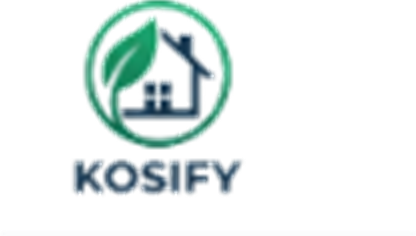

# 🏠 KOSIFY — Platform Manajemen & Pemesanan Kos Modern

<p align="center">
  
</p>

<p align="center">
  <strong>Solusi terintegrasi untuk pencarian hunian kos, reservasi online, payment gateway otomatis, kontrak sewa digital, dan pembukuan keuangan kos-kosan berbasis cloud.</strong>
</p>

<p align="center">
  
  
  
  
  
</p>

---

## 📖 Deskripsi Singkat Repository (About / Description)

> **Kosify** adalah aplikasi web manajemen dan booking kos modern yang mengotomatisasi seluruh siklus bisnis kos-kosan: mulai dari katalog kamar interaktif, booking daring, payment gateway multi-channel (QRIS, VA Bank, E-Wallet), penerbitan kuitansi & surat perjanjian sewa otomatis, AI Customer Service 24/7, hingga pembukuan arus kas dan manajemen komplain penghuni.

---

## ✨ Fitur Utama (Key Features)

### 1. 🔍 Katalog & Reservasi Kamar Interaktif
- **Pill Search & Filter Dinamis:** Pencarian nomor kamar/tipe dan filter status (*Tersedia / Terisi*) serta rentang harga menggunakan menu mengambang responsif.
- **Kalkulator Sewa Otomatis:** Menghitung total biaya berdasarkan tanggal mulai dan durasi sewa (1–12 bulan) secara real-time.
- **Ulasan & Rating Penghuni:** Sistem rating bintang (1–5) dan testimoni asli dari penyewa kamar.

### 2. 💳 Multi-Channel Payment Gateway & Verifikasi
- **Midtrans Snap Integration:** Pembayaran instan otomatis via **QRIS (GoPay, OVO, ShopeePay, Dana)**, **Virtual Account (BCA, Mandiri, BRI, BNI)**, dan Kartu Kredit.
- **Direct Bank Transfer:** Opsi transfer manual ke rekening pengelola kos dilengkapi fitur unggah bukti struk transfer.
- **Status Sinkronisasi Otomatis:** Kamar otomatis berubah menjadi *Terisi* saat pembayaran terverifikasi.

### 3. 📄 Dokumen Hukum & Kuitansi Digital Siap Cetak
- **Kuitansi Resmi (Official Invoice PDF):** Dilengkapi rincian biaya, ID transaksi, status lunas, dan cap resmi.
- **Surat Perjanjian Sewa (Legal Contract PDF):** Pasal-pasal hak dan kewajiban penyewa & pengelola kos yang sah secara hukum.

### 4. 🤖 AI Customer Service Chatbot (24/7 Virtual Assistant)
- Asisten virtual AI berbasis NLP yang mampu menjawab pertanyaan calon penyewa mengenai harga sewa, ketersediaan kamar, fasilitas, jam malam, dan tata cara booking secara natural.

### 5. 📊 Panel Administrator Lengkap (Owner Dashboard)
- **Ringkasan Properti & Arus Kas:** Total pendapatan bulanan, unit aktif, penyewa baru, dan saldo laba bersih.
- **Due Date Leases Reminder:** Notifikasi penyewa yang mendekati jatuh tempo sewa (< 7 hari) dengan tombol direct chat WhatsApp.
- **Export Laporan Keuangan CSV/Excel:** Unduh rekapitulasi pembukuan transaksi dalam 1 klik.
- **Manajemen Komplain / Tiket Kendala:** Meninjau dan memperbarui status penanganan keluhan fasilitas kos (AC, pipa air, listrik, WiFi).

### 6. 📱 100% Responsif & Antarmuka Modern
- Desain *glassmorphism* dengan backdrop blur, animasi halus berbasis Turbo Drive, dan navigasi hamburger drawer melayang pada smartphone (HP), tablet, maupun desktop.

---

## 🛠️ Tech Stack & Arsitektur

| Layer | Teknologi |
| :--- | :--- |
| **Backend Framework** | Laravel 11.x (PHP 8.2+) |
| **Database** | PostgreSQL (Supabase Cloud Database) |
| **Frontend Styling** | Tailwind CSS 3.x, Alpine.js, Turbo Drive |
| **Payment Gateway** | Midtrans Core & Snap API (Sandbox & Production ready) |
| **AI Integration** | Gemini AI / Custom NLP Engine |
| **Template Engine** | Blade Component Architecture |

---

## 🚀 Panduan Instalasi (Getting Started)

### 1. Prasyarat Sistem
- PHP >= 8.2 dengan ekstensi `pdo_pgsql`, `openssl`, `mbstring`, `curl`
- Composer 2.x
- Node.js >= 18.x & NPM
- Akun Supabase (Database PostgreSQL) & Akun Midtrans (Payment Gateway)

### 2. Kloning Repository & Instalasi Dependensi
```bash
git clone https://github.com/username-anda/kosify.git
cd kosify

# Install PHP dependencies
composer install

# Install JS dependencies & build assets
npm install
npm run build
```

### 3. Konfigurasi Environment (`.env`)
Salin file `.env.example` menjadi `.env`:
```bash
cp .env.example .env
php artisan key:generate
```

Sesuaikan konfigurasi database dan payment gateway pada file `.env`:
```env
APP_NAME="Kosify"
APP_ENV=local
APP_URL=http://127.0.0.1:8000

# Database Supabase PostgreSQL
DB_CONNECTION=pgsql
DB_HOST=aws-0-ap-southeast-1.pooler.supabase.com
DB_PORT=6543
DB_DATABASE=postgres
DB_USERNAME=postgres.your_supabase_id
DB_PASSWORD=your_supabase_password

# Midtrans Configuration
MIDTRANS_SERVER_KEY=SB-Mid-server-xxxxxxxxxxxx
MIDTRANS_CLIENT_KEY=SB-Mid-client-xxxxxxxxxxxx
MIDTRANS_IS_PRODUCTION=false
```

### 4. Migrasi Database & Storage Link
```bash
php artisan migrate --seed
php artisan storage:link
```

### 5. Jalankan Server Aplikasi
```bash
php artisan serve
```
Akses aplikasi melalui browser di `http://127.0.0.1:8000`.

---

## 🔐 Akun Default untuk Pengujian (Testing Accounts)

| Peran (Role) | Email | Password Default | Hak Akses |
| :--- | :--- | :--- | :--- |
| **Administrator** | `bagasirbany@kosify.com` | `password` | Akses penuh manajemen kamar, penyewa, keuangan, verifikasi, dan laporan. |
| **Penyewa (Tenant)** | `penyewa@kosify.com` | `password123` | Akses pencarian kamar, checkout booking, kuitansi digital, & komplain. |

---

## 📜 Lisensi & Kontributor

Dikembangkan dengan dedikasi untuk memodernisasi industri hunian kos di Indonesia.

- **Author:** Bagas Irbany & Tim Pengembang Kosify
- **Lisensi:** [MIT License](LICENSE)
